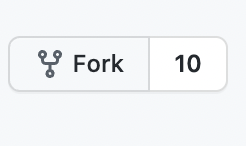

# Contribution Guidelines

> This repository is open to the mentees of Codess Cafe only! This repository is a great way to begin your journey in open source, especially if you are just getting started and need some help!

## Table of Contents
- [Contribution Guidelines](#contribution-guidelines)
  - [Table of Contents](#table-of-contents)
  - [Introduction](#introduction)
  - [Getting Started](#getting-started)
    - [Issues](#issues)
    - [Pull Requests](#pull-requests)
      - [Finding An Issue](#finding-an-issue)
      - [Forking](#forking)
      - [Setting Up Remotes](#setting-up-remotes)
      - [Making A Branch](#making-a-branch)
      - [Pushing Your Changes](#pushing-your-changes)
      - [Opening the Pull Request](#opening-the-pull-request)

## Introduction

To start with, read the `README.md` file to `understand` the project, what it is `about`, how to `use` and `install` the code, `setting up` the bot on your system, the `features` of the bot, and most importantly, details about how the bot was `developed`.

If you intend to contribute code, having some basic knowledge of Python would be very helpful. [This](https://www.freecodecamp.org/news/create-a-discord-bot-with-python/) is a great resource to learn about how to build discord bots with Python!

## Getting Started

### Issues

If you believe this project has some `bugs`, some `functionality that doesn't work correctly`, or some `additional feature` that can enhance the application, add it to the `Issues` tab [here](https://github.com/Codess-Cafe/Python-discord-bot/issues). 

Click on the `new issue` button in the top right of the `issues tab` to add an issue.


Make sure you are as descriptive while adding the `issue name`, provide `sufficient information`, and maybe `some ideas` in the `description` section, and add the correct `labels` depending on the type of issue. 

### Pull Requests

#### Finding An Issue

Head over to the `issues` tab [here](https://github.com/Codess-Cafe/Python-discord-bot/issues) and search for an issue that you believe you can make a useful contribution to depending on your skill set. If the issue has not been assigned to anyone, comment on it and wait for the maintainers to assign it to you. You will receive a notification when you have been assigned, and you can follow the steps below to start contributing!

#### Forking

To get started, `fork` this repository so you have a version of it on your GitHub as well, so you can work on it and improve it independently. 

To fork a repository, just click on the `fork` button in the top right corner of the screen.



Next, make a `local clone` of your `forked repository` by clicking on the `code` button, and copying the repository's `URL`.


Type the following command in the terminal:

```bash
$ git clone <URL_OF_FORK>
```

You now have a local copy of the code to work with! 

#### Setting Up Remotes

Your local copy of the code is called an `origin remote` and the main code is called the `upstream remote`. It's very important for the remotes to be synched with each other to prevent problems while merging. `Merging` refers to adding your contributions to the main repository.

The origin remote is automatically set to your cloned fork. In case it isn't, you can set up the `origin remote` by running the following command:

```bash
$ git remote add origin <URL_OF_FORK>
```

To add the main repository as an upstream, run the following command:

```bash
$ git remote add upstream https://github.com/Codess-Cafe/Python-discord-bot.git
```

You can verify your remotes are correct by running the following command:

```bash
$ git remote -v
```

To ensure that your copy of the code is always up to date with all changes being made in the main repository, make sure you pull the changes from the main repository whenever they are made to make sure both versions of the repository are synched. To pull from the upstream remote, run the following command:

```bash
$ git pull upstream main
```

Here, `main` could be substituted for whatever branch of the main repository you intend to pull from.

#### Making A Branch

A branch is like a different version of the project with a different name, and different changes in the code. They allow you to safely experiment with and work on new ideas for your project.

It is usually a good idea to create a new branch when you work on an issue rather than the main branch so you can make sure that your work environment is kept isolated from the main branch. To create a new branch, run the following command:

```bash
$ git checkout -b <YOUR_BRANCH_NAME>
```

To show all your local branches, run the following command: 

```bash
$ git branch -v
```

Your new branch should have an asterisk because it's the branch you'll be pushing all your changes to.

#### Pushing Your Changes
 
You are finally ready to start contributing!

Make the required changes to the local clone so it tackles the issue that you are assigned. Then, you need to add your files to the staging area, commit them to your repository, and push them to the branch of your clone.

Run the following commands:

```bash
$ git add .
```

To add all files to the staging area. Instead of `.` you can simply add the names of files you have changed.

```bash
$ git commit -m "<YOUR_COMMIT_MESSAGE>"
```

To make sure these changes are made. Make your commit message as descriptive as possible so that the maintainers can understand what changes you made and why you made them.

```bash
$ git push origin <YOUR_BRANCH_NAME>
```

To push your changes to the branch you have created specifically for this issue. You will now see your changes reflected in the repository under your new branch name.

#### Opening the Pull Request 

Refresh the page, and you will see a new button that says `Compare and Pull Request` next to your commits.


Click on this button, and add a descriptive name for your pull request along with explanatory comments describing what the pull request will achieve. Make sure the name of the pull request includes the name and number of the issue it solves, and what it does. The description section can include more information about the pull request and how it works.

It is a good idea to check if the pull request is able to merge. The message will be shown under the branch names. If you pulled changes from the upstream, you should not face any issues while opening the pull request. If not, you may cause a merge conflict, which means your code can not be included in the main code.

If you followed the steps above correctly, the maintainers will review your pull request and merge it into the main repository. Your code can now be seen and used by everyone who uses the repository!


In case of any doubts or questions, you can reach out to the maintainers or mentors to help you out. 

Happy Hacking and all the best!