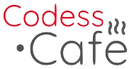

# Python Discord Bot
> Daily DSA Bot

An open source project developed by the mentees of [Codess Cafe](https://codess.cafe/) that involves a discord bot that posts data structures and algorithms questions everyday for daily coding practice.

[Codess Cafe](https://codess.cafe/) provides pro-bono mentorship for collegiate women in tech.

## Table of Contents 
- [Python Discord Bot](#python-discord-bot)
  - [Table of Contents](#table-of-contents)
  - [Installation / Getting Started](#installation--getting-started)
  - [Initial Configuration](#initial-configuration)
    - [Creating the Bot Account](#creating-the-bot-account)
    - [Inviting the bot to the server](#inviting-the-bot-to-the-server)
  - [Development](#development)
    - [Usage](#usage)
    - [Building](#building)
      - [Events](#events)
      - [Commands](#commands)
      - [APIs](#apis)
  - [Features](#features)
  - [Contributing](#contributing)
  - [Important Links](#important-links)
  - [Licensing](#licensing)

## Installation / Getting Started

Ensure you have all the required libraries in `requirements.txt`.

```bash
$ pip3 install -r requirements.txt
```

To run the bot you need to be logged into Discord and have admin access (`Manage Server Permissions`) to the server where you intend to use the bot.

Clone this repo by following the instructions below:

```bash
$ git clone https://github.com/Codess-Cafe/Python-discord-bot.git
$ cd Python-discord-bot 
$ python3 bot.py 
```

If you have followed the configuration steps, the code in the above repository should activate the discord bot.

## Initial Configuration

### Creating the Bot Account
- Create a discord account, log in, and navigate to the `application page`.
- Assign a name to the application and click on `Create`.
- Head to the `Bot` tab, click on `Add Bot`, and confirm.
- Keep the default settings (check `Public bot` and uncheck `Require OAuth2 Code Grant`)

The bot now has an account on Discord!

Copy the token given because it will be needed to log into the bot and use it in your server. Ensure that no one else has access to this token because it gives the owner free access to the bot.

Add the token to `bot.py` at the head of the file in the following manner:

```python
TOKEN = "YOUR_TOKEN_HERE"
```

### Inviting the bot to the server
- After adding the bot to the server, we need to create an `invite link` for the bot.
- Go to the `OAuth2` tab and select `scopes`.
- Choose `permissions` for the bot according to your requirements (for this bot, selecting `text permissions` is sufficient).
- Next, select the `copy` button above permissions and paste the `URL` in the browser.
- Choose a server for which you have `Manage Server Permissions` and click on `Authorize`.

Your bot has now been added to the server! 

More information about creating and using Discord bots is available in the Discord Documentation [here](https://discordpy.readthedocs.io/en/stable/discord.html).

## Development

The discord bot is built primarily in `Python`, making use of the `discord.py` library. 

### Usage

- Clone the repository and follow the configuration steps. You can run the code either on your local machine or on an online platform such as `repl.it`.
- If running on your local machine, run the following code in your terminal:
  ```shell
  $ python3 bot.py
  ```
- The bot should now respond to your messages and commands! The command prefix is specified in the `bot.py` file as `!`, so add this prefix to every command sent in the server to get the correct response. For example, try entering the following command in the server:
  ```
  !description
  ```

### Building

#### Events
The bot detects messages from all users that are not the bot itself and does the following:
- Scans greetings present in the `mssg` list which contains various case insensitive greetings, and if they are present, it returns a random greeting from the greetings array.
- Scans messages for the word `quote` and returns a random quote from the `ZenQuotes API`.
- Scans messages for the word `joke` and returns a random joke from the `Joke API`.

#### Commands
The bot detects commands that begin with the command prefix `!` and does the following:
- Responds to the `faq` command by searching for a `user specified keyword` in the user's message and returning a suitable response.
- Responds to the `description` command by returning the description of what the bot does. This is stored as predefined variable.


#### APIs
The bot uses external APIs to fetch data required by the user.

- The `ZenQuotes API` involves sending a request to [this URL](https://zenquotes.io/api/random) which returns a `JSON` variable consisting of the `quote` which is stored in the identifier `q`, and `author` which is stored in the identifier `a` of the returned object.
- The `Joke API` involves sending a request to [this URL](https://v2.jokeapi.dev/joke/Any?safe-mod) which returns a `JSON` variable consisting of `setup` which is stored in the `setup` identifier, and `delivery` which is stored in the identifier `delivery` of the returned object. Appending `safe-mod` at the end of the request ensures clean, non-explicit jokes.

[This website](https://premium.zenquotes.io/zenquotes-documentation/) contains more information about the `ZenQuotes API`.

[This website](https://v2.jokeapi.dev/) contains more information about the `Joke API`.

## Features

* The bot posts a random `Data Structures and Algorithm` programming questions everyday.
* The bot `takes input` to record whether the question that day was solved.
* The bot responds to `greetings` like "Hi", "Hello", etc. and responds in kind.
* The bot responds to the `!description` command and responds with a description of its functionalities.
* If the user mentions `quote` in their message, the bot returns a joke using the `ZenQuotes API`.
* If the user mentions `joke` in their message, the bot returns a joke using the `Joke API`.
* The bot responds to the `count` command and returns the number of questions solved by that user.
* The bot responds to the `!faq` command by returning a response to `frequently asked questions` based on a `keyword` entered by the user.


## Contributing


> **NOTE**: This project is **only** for mentees of Codess Cafe under open source track. 

- Head over to `issues` tab and grab any `good-first-issue`.
- Comment on the issue and ask for it to be assigned to you.
- After the issue is assigned, `fork` the repository and create a local clone.
- Get contributing and open a `pull request` to get your code added to the `main branch`!

Add any issues or features that you think will improve the application in the issues tab!

All contributions and features are welcome!

## Important Links

- Repository: https://github.com/Codess-Cafe/Python-discord-bot
- Issue tracker: https://github.com/Codess-Cafe/Python-discord-bot/issues
- Codess Cafe Website: https://codess.cafe/


## Licensing
 
> The code in this project is licensed under MIT license as found in the `LICENSE` file, and below as well.

MIT License

Copyright (c) 2021 Codess.Cafe

Permission is hereby granted, free of charge, to any person obtaining a copy
of this software and associated documentation files (the "Software"), to deal
in the Software without restriction, including without limitation the rights
to use, copy, modify, merge, publish, distribute, sublicense, and/or sell
copies of the Software, and to permit persons to whom the Software is
furnished to do so, subject to the following conditions:

The above copyright notice and this permission notice shall be included in all
copies or substantial portions of the Software.

THE SOFTWARE IS PROVIDED "AS IS", WITHOUT WARRANTY OF ANY KIND, EXPRESS OR
IMPLIED, INCLUDING BUT NOT LIMITED TO THE WARRANTIES OF MERCHANTABILITY,
FITNESS FOR A PARTICULAR PURPOSE AND NONINFRINGEMENT. IN NO EVENT SHALL THE
AUTHORS OR COPYRIGHT HOLDERS BE LIABLE FOR ANY CLAIM, DAMAGES OR OTHER
LIABILITY, WHETHER IN AN ACTION OF CONTRACT, TORT OR OTHERWISE, ARISING FROM,
OUT OF OR IN CONNECTION WITH THE SOFTWARE OR THE USE OR OTHER DEALINGS IN THE
SOFTWARE.


